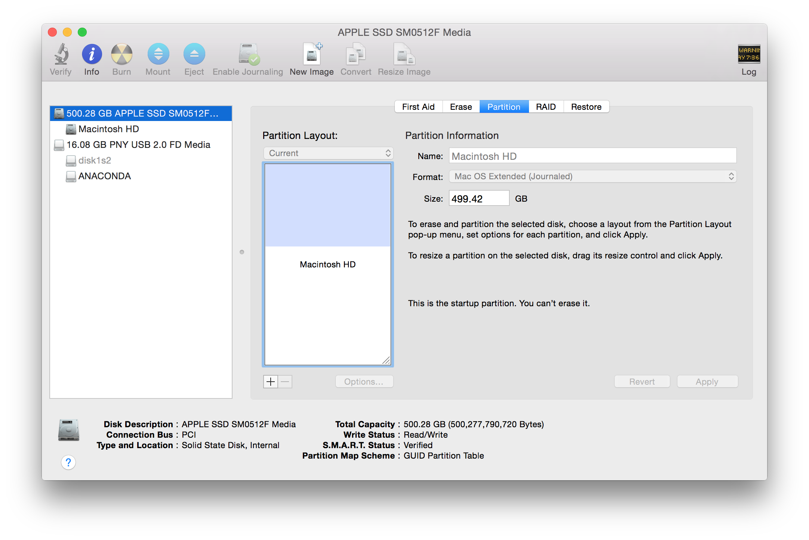
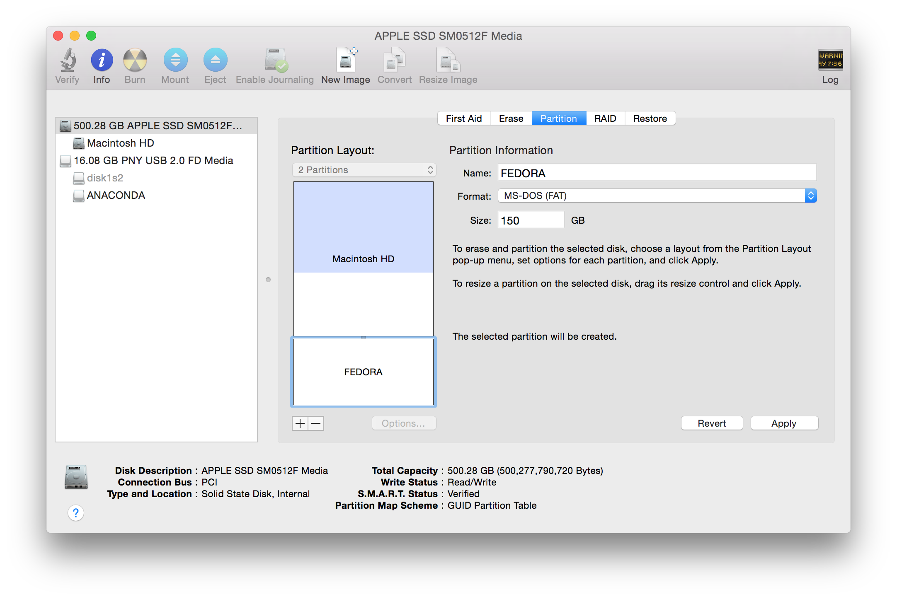
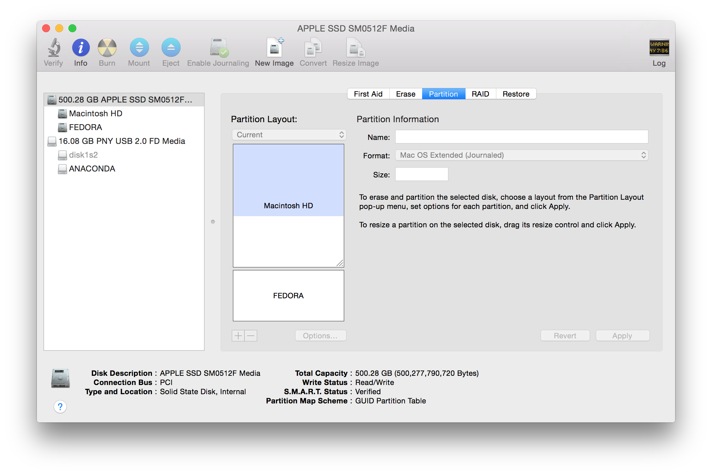
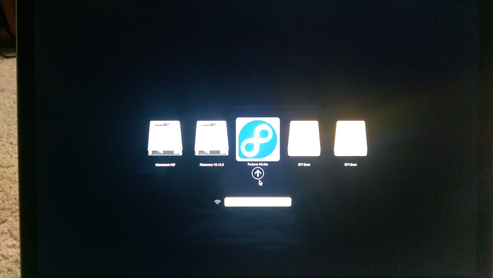
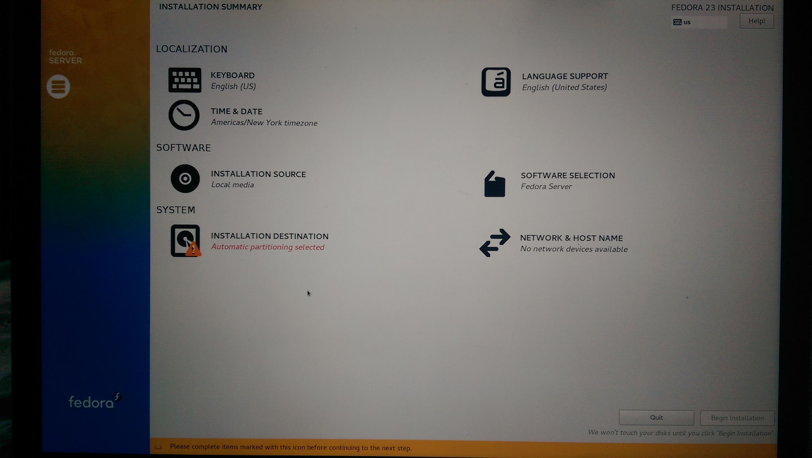
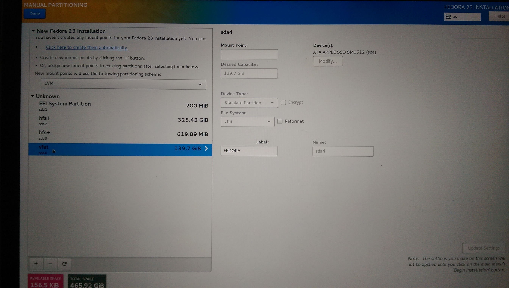
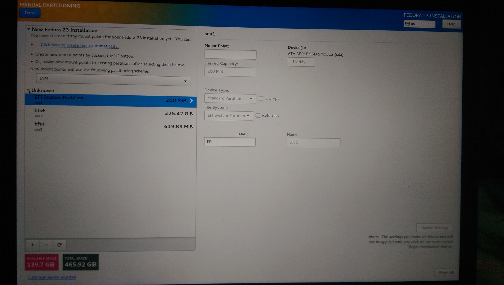
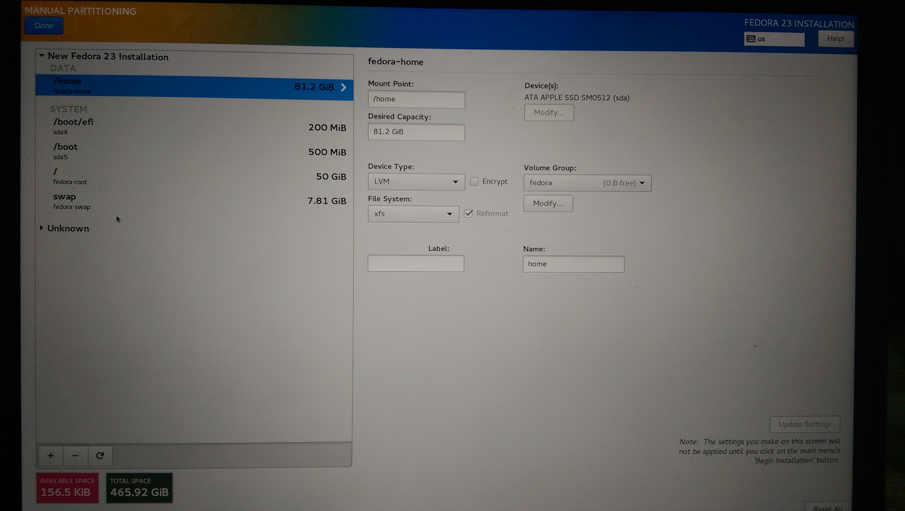
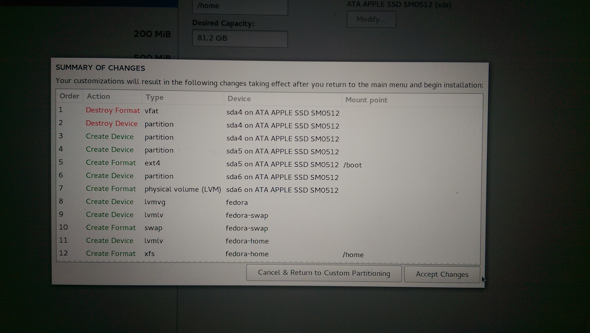
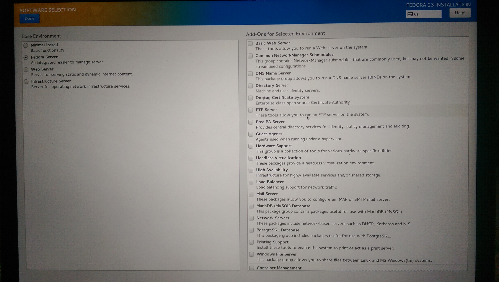

# Guide to installing Fedora 23 on Mac

## Preparing the installation media 

1. Download [Fedora 23 Server](https://download.fedoraproject.org/pub/fedora/linux/releases/23/Server/x86_64/iso/Fedora-Server-DVD-x86_64-23.iso)

2. Plug-in a sacrificial USB with at least 3 GB of storage space onto your Mac 
3. Run the command `diskutil list` and view the output, it should look somewhat like the output below. Note the number **N** at the end of the device name, in my case the number is 1. We will need this number for running the next command.
  
  ```sh
  /dev/disk0
     #:                       TYPE NAME                    SIZE       IDENTIFIER
     0:      GUID_partition_scheme                        *500.3 GB   disk0
     1:                        EFI EFI                     209.7 MB   disk0s1
     2:                  Apple_HFS Macintosh HD            349.4 GB   disk0s2
     3:                 Apple_Boot Recovery HD             650.0 MB   disk0s3
     4:                  Apple_HFS Linux HFS+ ESP          209.7 MB   disk0s4
     5: 0FC63DAF-8483-4772-8E79-3D69D8477DE4               524.3 MB   disk0s5
     6:                  Linux LVM                         149.3 GB   disk0s6
  /dev/disk1
     #:                       TYPE NAME                    SIZE       IDENTIFIER
     0:     FDisk_partition_scheme                        *16.1 GB    disk1
     1:                 DOS_FAT_32 VIJAY                   16.1 GB    disk1s1
  ```

4. Unmount the USB device by the following command

  ```sh
  # Replace N with the number you noted earlier
  diskutil unmountDisk /dev/diskN
  ```

5. Change directory to the folder where you downloaded **Fedora-Server-DVD-x86_64-23.iso** file and run the follwing command:

  ```sh
  # Intermediate status can be checked with CTRL+T while the 
  # command is still running
  sudo dd if=Fedora-Server-DVD-x86_64-23.iso of=/dev/rdisk1 bs=1m
  ```
  
## Creating a new partition

1. Open **Finder → Utilities → Disk Utility**. Choose the top-level SSD on the left and **Partition** on the right as shown in the image below.
  [](.images/fom-disk-utilities-mac-partition.png)
2. Click on the **+** symbol and a new partition and call it **Fedora**, make selections such that your choices resemble the image below and click **Apply**
  [](.images/fom-add-fedora-partition.png)
3. The disk layout should now look like the image below.
  [](.images/fom-fedora-partition.png)

## Fedora 23 Installation

1. Open this page in your phone/tablet or any other device/computer
2. Plug-in the USB and restart the Mac. Before the Mac could boot up press and hold the **alt/option** button. You should be presented with a screen that resembles the image below. Choose **Fedora Media** and double-click/enter.
  [](.images/fom-fedora-usb.jpg)
3. Choose the default **Language** and **Keyboard** and continue
4. When presented with a screen like the one shown below, click on the **Installation Destination**
  [](.images/fom-install-screen.jpg)
5. Find the **Fedora** partition, as shown in the image below, and delete it; this will create space for your installation
  [](.images/fom-find-fedora-partition.jpg)
6. Click on tha link that says **Click here to create them automatically**, as shown in the image
  [](.images/fom-deleted-fedora-partition.jpg)
7. Post creation your partitions should look like the image below. Click **Done** on the top left hand corner.
  [](.images/fom-auto-mount-point-creation.jpg)
8. You will now be presented with **Summary of Changes**, make sure you review them and be 100% sure that your Mac partition is unaffected as shown in the image below
  [](.images/fom-apply-partition-changes.jpg)
9. After the review click on **Accept Changes**
10. Before you click on **Begin Installation**, make appropriate software selection by clicking on the **Software Selection** option on the main screen which will lead you to the screen like the one shown below
  [](.images/fom-software-choices.jpg) 

## Post-Installation Steps

1. Run the following command with your workstation connected to a wired network connection. This is bring you up to speed on many updates that you might need. Make sure the user you are logged into has sudoer permissions.

  ```sh
  curl https://raw.githubusercontent.com/vchintal/fedora23-on-mac/master/setup.sh | sh
  ```

2. To get the right drivers installed for wireless connectivity, run the following command, [courtesy of Corey](https://onpub.com/install-broadcom-linux-wi-fi-driver-on-fedora-23-s7-a192)

  ```sh 
  wget http://git.io/vuLC7 -v -O fedora23_broadcom_wl_install.sh && sh ./fedora23_broadcom_wl_install.sh;
  ```

**Note!**

> The above command may fail citing some error as mentioned in the blog. This is related to a kernel mismatch. The workaround I discovered is to edit the **Makefile** in the folder **hybrid_wl_f23** (that got created in the folder where you ran the command from) and search/replace **\`uname -r\`** with **4.2.3-300.fc23.x86_64** and then run the following commands (in the same folder):

```sh 
make clean && make
sudo make install
sudo depmod -a
```

